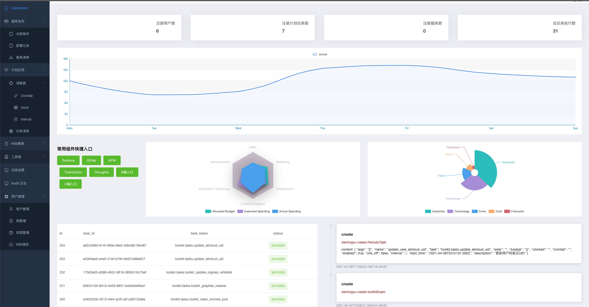
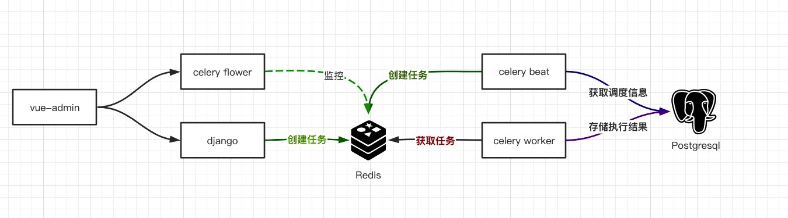
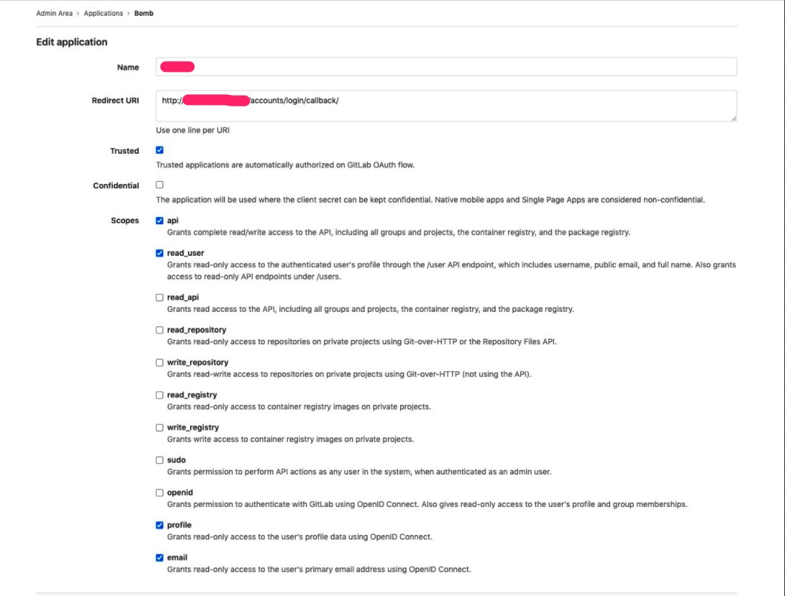
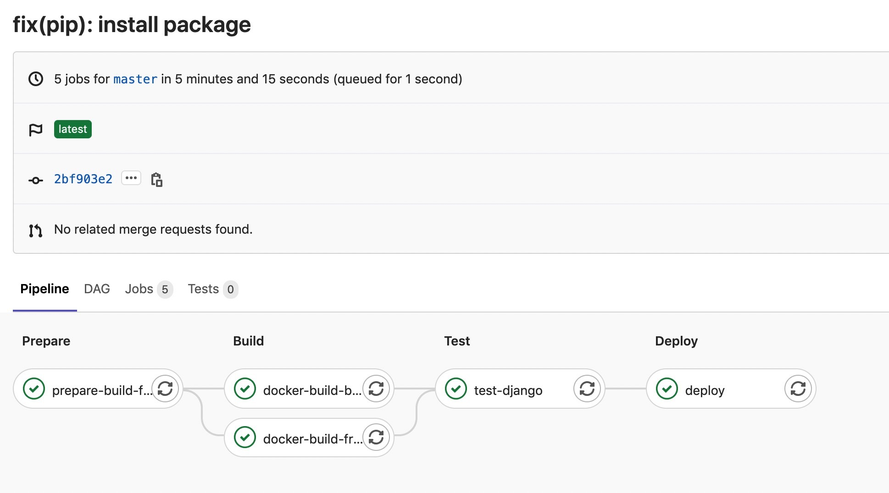

# bomb
---
devops 运维工具平台，采用前后端分离进行开发，前端使用 vue-element-admin、后端使用 Django 进行开发。界面如下：


### 文件夹
```shell
(venv) ➜  bomb git:(master) ✗ tree -L 1
.
├── README.md       # readme
├── django          # 后端代码
├── docker          # 打包用 dockerfile
├── charts          # 部署用 helm chart
└── vue-admin       # 前端代码
└── .gitlab-ci.yml  # CI/CD 配置

4 directories, 2 file

```

### 架构



### 本地开发

请使用`python3`进行项目开发, 并提前创建 `redis` 和 `postgresql` 数据库，完成环境变量配置.
* 环境变量
```shell
export GITLAB_ACCESS_KEY=xxxxxx
export INGRESS_TRIGGER_TOKEN=xxxxxx
export EXAM_TRIGGER_TOKEN=xxxxxx
export GITLAB_CLIENT_SECRET=xxxxxx
export GITLAB_CLIENT_ID=xxxxxx
export GITLAB_SERVER=xxxxxxx
export K8S_TRIGGER_TOKEN=xxxxxx
export JUDGER_TRIGGER_TOKEN=xxxxxx
```

* vue-admin
  * `cd vue-admin && npm install` (安装前端依赖)
  * `npm run dev` （启动开发服务）
  * 如新增加后端路由需要在 vue.config.js 中配置跨域代理。

* django
  * `cd django && pip install -r requirements.txt` (安装 pip 依赖包)
  * 设置环境变量（参考部署部分）
  * `python manage.py makemigrations && python manage.py migrate` (表结构初始化)
  * `python manage.py runserver 0.0.0.0:8000` (启动开发服务)

### 系统配置
#### Django （django/bomb/settings.py）
* rest_framework 
  * 配置块 `REST_FRAMEWORK`，需要注意使用自定义 `exception_handler` 是导入路径配置。
* jwt
  * 登陆使用jwt进行 token 签发，配置块 `JWT_AUTH`.
  * 默认登陆一次有效期 1 天，如需修改可变更 `JWT_EXPIRATION_DELTA`。
  * `JWT_AUTH_COOKIE` 设置 token 在 request cookie 中的存储 key，默认为 `token`。
* gitlab oauth2

  * gitlab 设置，需要注意 redirect_uri 协议、host、url必须正确填写、scopes 需要按需给够权限，创建完成后获取ID、secret。
    * 
  
  * 使用 `django-gitlab-auth==0.1.1`，该包初始化需要读取 `GITLAB_SERVER` `GITLAB_CLIENT_ID` `GITLAB_CLIENT_SECRET`, code如下
  ```python
    SERVER        = os.getenv("GITLAB_SERVER", "https://gitlab.com/")
    CLIENT_ID     = os.getenv("GITLAB_CLIENT_ID")
    CLIENT_SECRET = os.getenv("GITLAB_CLIENT_SECRET")

    if SERVER and CLIENT_ID and CLIENT_SECRET:
        server = AuthorizationServer(SERVER, CLIENT_ID, CLIENT_SECRET)
  ```
* celery 
  * 配置块：settings.py 中所有 prefix 为 `CELERY_`的配置。
  * `CELERY_REDIS_URL` 使用redis作为消息中间件，如需自定义redis地址请设置此环境变量 
  * `CELERY_BEAT_SCHEDULER` 设置beat scheduler 类型，本项目使用 `DatabaseScheduler`，默认读取 Django 的 DB 地址。
  
* toolkit
  * toolkit 为了整合了原来的一些注册在gitlab pipeline 中的任务复用了这部分的工作，该 APP 下的任务工作模式多为通过django 创建任务，trigger gitlab pipeline，通过获取 pipeline 相关信息来进行状态更新。因此每个任务一般需要 如下几个 环境变量
  * `GITLAB_ACCESS_KEY` 访问 gitlab 的账户信息，当前项目默认使用 `lc-pipeline-bot`，注意在仓库的 `member` 设置对应的权限。
  * `<task>_PROJECT_ID` 仓库 ID 信息。
  * `<task>_TRIGGER_TOKEN` pipeline trigger token。设置方法自行查询 gitlab 文档。
  * `<task>_TRIGGER_REF` pipeline 触发分支。
  * `<task>_JOB_NAME` 如果需要获取输出结果可能还需要知道对于 job name, 创建压测考试项目中会获取job 日志，读取考试信息。
  * `SERVICES_MAP` 此Key 存储了 autoscaling 相关信息，当使用 autoscaling 扩容服务时需要提前在此 key 下注册相关信息。并在对于 repo 中创建触发器。
  
#### Vue-admin
* nginx.conf
    * 当后端新增加路由时，在部署生产环境时需要在 `nginx.conf` 增加反向代理配置，否则 vue 会直接 404，本地开发时参考下一节: **本地跨域问题解决**
* 本地跨域问题
  * 本地开发出现跨域问题时，可以用本地代理处理跨域问题，在 `vue.confing.js` 文件中增加对应路由配置, 配置参考：
```js
  module.exports = {
  devServer: {
    proxy: {
      '/group': {
        target: 'http://localhost:8000/',
        ws: true,
        changeOrigin: true,
      },
      '/user': {
        target: 'http://localhost:8000/',
        ws: true,
        changeOrigin: true,
      },
      '/permissions': {
        target: 'http://localhost:8000/',
        ws: true,
        changeOrigin: true,
      }，
    }
  }
}
```

### Docker build

```shell

## npm生成静态资源
(venv) ➜  bomb git:(master) ✗ cd vue-admin && npm run build

## 如使用uwsgi 还需要collect admin 的静态资源
(venv) ➜  bomb git:(master) ✗ cd django && python manage.py collectstatic

# build 前端
(venv) ➜  bomb git:(master) ✗ docker build -t xiemx:frontend-xxxxxx -f docker/Dockfile.frontend .

# build 后端
(venv) ➜  bomb git:(master) ✗ docker build -t xiemx:backend-xxxxxx -f docker/Dockfile.backend .
```

### helm charts

存放在 charts 目录，自行查阅

### CI/CD

自行查阅 .gitlab-ci.yml

